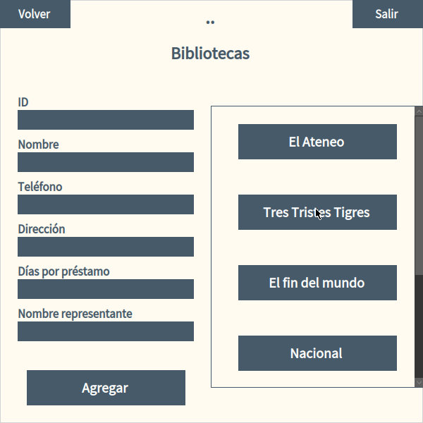

<!-- SUMMARY -->
<div align="center">

# Books Check Out System

Pharo Smalltalk based desktop app to manage libraries, users and books check out following [this assignment](https://drive.google.com/file/d/1CNY19oGeFIWrILSWgABQOcizOUSftZJJ/view?usp=sharing)

[![Licence][license-shield]](./LICENSE)

</div>

<!-- SCREENSHOTS -->
<details> <summary>Screenshots</summary>




</details>

<!-- BUILT WITH -->
## Built With

- [![PHARO][pharo-shield]][pharo-url]

<!-- GETTING STARTED -->
## Getting Started

- Import the project package into your image by using the following code in your Pharo Playground
```smalltalk
Metacello new
baseline:'Administrador';
repository: 'github://facundoMunoz/books-check-out-system:main/src'; load.
```

<!-- USAGE -->
## Usage

- Use the following method to start the app
```smalltalk
SistemaVisual crear
```

### Example

- The app has no data by default, to create example libraries, users and check outs use the following code instead
```smalltalk
SistemaVisual crearConDatos
```

<!-- CONTACT -->
## Contact
[![GITHUB][personal-shield]][personal-url] [![LINKEDIN][linkedin-shield]][linkedin-url]

<!-- ACKNOWLEDGMENTS -->
## Acknowledgments

This project was made using the following recources :heart:

- *Aytar O. (2002). A guide to work with squeak morph classes. Northeastern University*

<!-- MARKDOWN LINKS AND IMAGES -->
<!-- BUILT WITH -->
[pharo-shield]: https://img.shields.io/badge/PHARO-SMALLTALK-blue?style=for-the-badge
[pharo-url]: https://pharo.org/
<!-- LICENSE -->
[license-shield]: https://img.shields.io/github/license/Ileriayo/markdown-badges?style=for-the-badge
<!-- MY GITHUB -->
[personal-shield]: https://img.shields.io/badge/FACUNDO-MU%C3%91OZ-yellowgreen?style=for-the-badge
[personal-url]: https://github.com/facundoMunoz
<!-- MY LINKEDIN -->
[linkedin-shield]: https://img.shields.io/badge/linkedin-%230077B5.svg?style=for-the-badge&logo=linkedin&logoColor=white
[linkedin-url]: https://www.linkedin.com/in/facundomunozdev/
